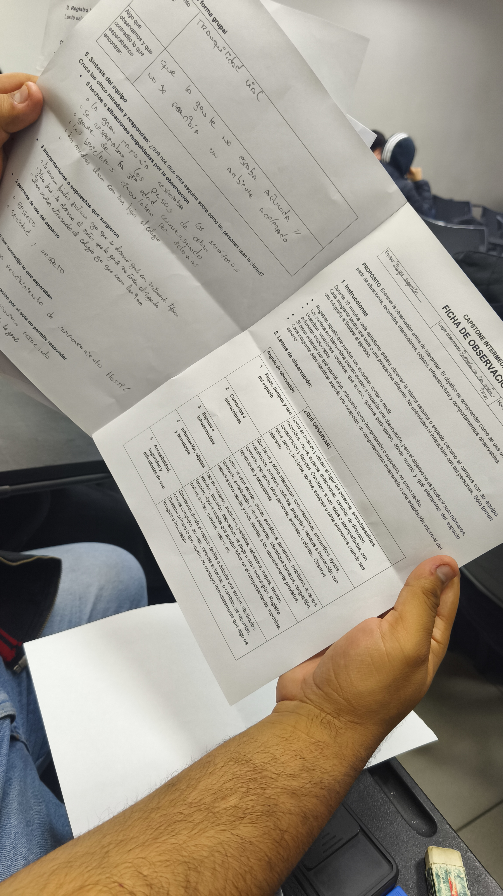
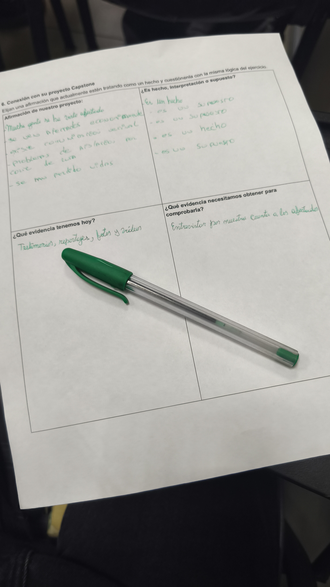

<!--
CÓMO USAR: reemplaza cada *(completar)* con tu contenido. Los bloques <!-- ... --> son guías y NO se ven en GitHub (puedes borrarlos al terminar).
Editar con: nano bitacora/S02.md
-->

# S02 — Observación en terreno y conexión con el desafío

**Fecha:** 08-09-2026

**Participantes:** Juan Burgos, Juan Alvarez, Maximiliano Yévenes, Emilia Marchant, Camila Rivera

**Lugar o modalidad:** — Campus Manuel Montt, Providencia y entorno cercano

**Tipo de sesión:** Clase 05 — ejercicio de observación de campo + puesta en común

## Objetivo de la sesión

Registrar observaciones de primera fuente de un espacio cercano al campus (sin interactuar con las personas) y traducirlas en **hallazgos** que conecten con nuestro desafío, usando el enfoque del doble diamante.

## 1. Comentarios de la Entrega 1 (S01)

Feedback general que dio la profesora a los equipos:

- Diferenciar **trabajo en equipo** v/s **trabajo en grupo** (se notó en algunas presentaciones).
- **Faltó uso de fuentes** que demostraran la investigación sobre el desafío.
- Faltó mayor **lenguaje no verbal** y fortalecer la comunicación verbal y no verbal.

Feedback específico a nuestro equipo: *(completar)*

**Compromiso de mejora:** *(completar)*

## 2. Actividad de observación (ejercicio de equipo)

**Consigna:** observar durante **10 minutos** la misma esquina o espacio cercano al campus con todo el equipo. Cada integrante usa una **lente/perspectiva distinta**. **No entrevistar ni interactuar** con las personas. Tomar **una sola fotografía** al finalizar. Completar los hallazgos como equipo y subirlos a la bitácora.

**Horario:** salida 8:30 — regreso a sala 9:30.

**Espacio observado:** *(completar: calle 4 sentidos Av. Nueva Providencia con Antonio Varas)*

### Lentes y responsables

| # | Lente / perspectiva | Integrante | Qué observa |
|---|---|---|---|
| 1 | Flujos, tiempos y uso del espacio | *(completar)* | Cómo circulan y permanecen las personas; tiempos y recorridos |
| 2 | Conductas e interacciones | *(completar)* | Qué hacen las personas y cómo se relacionan entre ellas |
| 3 | Espacio e infraestructura | *(completar)* | Elementos físicos, mobiliario, estado y uso del espacio |
| 4 | Información, objetos y tecnología | *(completar)* | Señalética, avisos, objetos y artefactos presentes |
| 5 | Accesibilidad, seguridad y dificultades de uso | *(completar)* | Barreras, riesgos y problemas de uso del espacio |

### Hallazgos por lente

<!-- En cada lente: describe lo observado (hecho objetivo, sin interpretar), la evidencia (qué lo respalda) y el hallazgo (qué conclusión sacamos). -->

#### Lente 1 — Flujos, tiempos y uso del espacio
- **Observación:** *(completar)*
- **Evidencia:** *(completar)*
- **Hallazgo:** *(completar)*

#### Lente 2 — Conductas e interacciones
- **Observación:** *(completar)*
- **Evidencia:** *(completar)*
- **Hallazgo:** *(completar)*

#### Lente 3 — Espacio e infraestructura
- **Observación:** *(completar)*
- **Evidencia:** *(completar)*
- **Hallazgo:** *(completar)*

#### Lente 4 — Información, objetos y tecnología
- **Observación:** *(completar)*
- **Evidencia:** *(completar)*
- **Hallazgo:** *(completar)*

#### Lente 5 — Accesibilidad, seguridad y dificultades de uso
- **Observación:** *(completar)*
- **Evidencia:** *(completar)*
- **Hallazgo:** *(completar)*

## 3. Fotos de la sesión

*Ficha de observación usada en la actividad (lentes y pauta).*

*Conexión de los hallazgos con nuestro proyecto Capstone.*

## 4. Síntesis del equipo

Qué se repite entre lentes, qué nos llamó la atención y qué conclusiones sacamos como equipo: está en la hoja, no le tomé fotos 

- *(completar)*

## 5. Conexión con el proyecto Capstone

En el ejercicio clasificamos una afirmación que sale del relato de la comunidad:

- **Afirmación:** «Los aluviones y cortes de ruta han afectado a mucha gente; se han perdido vidas».
- **Clasificación:** **supuesto** (todavía no es un hallazgo propio).
- **Evidencia actual:** testimonios, reportajes, fotos y videos.
- **Evidencia que debemos obtener:** **entrevistar a personas afectadas**.

**Implicancia para el proyecto:** *(completar — qué cambia o qué confirma esto en nuestro desafío)*

**Preguntas «¿Cómo podríamos…?» que nos surgen:** *(completar)*

## 6. Conceptos clave de la clase

- **Doble diamante:** dos ciclos divergente/convergente — **Descubrir → Definir → Desarrollar → Entregar**. Recopilar información y observación plena; sintetizar; generar alternativas y prototipos; implementar, evaluar y validar. El proceso es **iterativo**, no lineal.
- **Desafío:** situación que requiere una solución o respuesta; no implica necesariamente un problema, motiva desarrollar capacidades.
- **Problemática:** conjunto de problemas interrelacionados o situación compleja que necesita análisis exhaustivo.
- **Problema:** circunstancia específica con dificultades concretas; más definido que una problemática, requiere soluciones directas.
- **Síntoma:** manifestación o indicador visible de un problema; no explica la causa por sí solo.
- **Evidencia:** observaciones, datos o información objetiva que demuestra que el problema existe.
- **Hallazgo:** dato concreto y específico obtenido de la investigación que explica qué está ocurriendo y por qué.
- **Ideación:** «Sólo se aceptan malas ideas». Primero lluvia de ideas amplia (divergir), sin filtrar; después se selecciona (convergir).

## 7. Decisiones y próximos pasos

| Decisión / tarea | Responsable | Fecha límite | Estado |
|---|---|---|---|
| *(completar)* | | | |
| Preparar la visita al **HUB de Providencia** (próxima clase) | *(completar)* | | Pendiente |
| Incorporar el uso de fuentes en la investigación del desafío | | | Pendiente |

## 8. Reflexión breve

- **Qué fue fácil:** *(completar)*
- **Qué fue difícil:** *(completar)*
- **Qué necesitamos resolver:** *(completar)*

<!-- Próxima clase: visita al HUB de Providencia. -->
